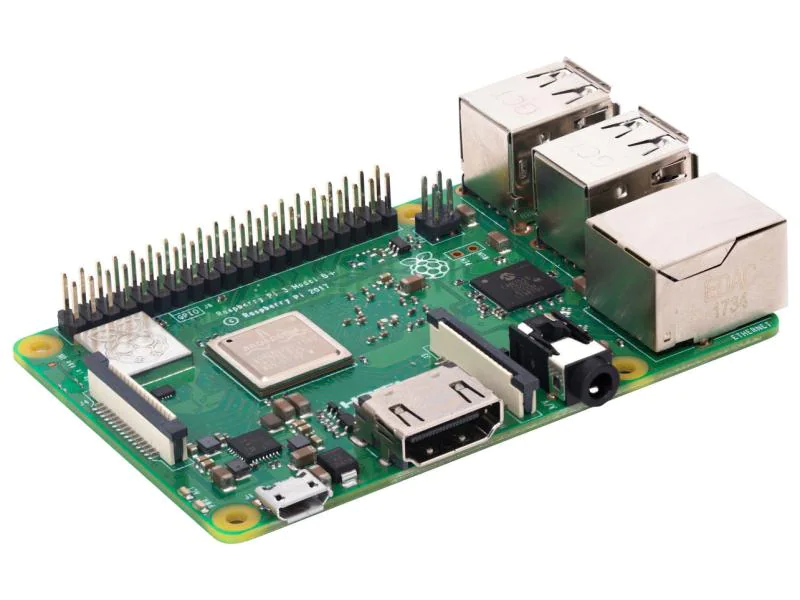
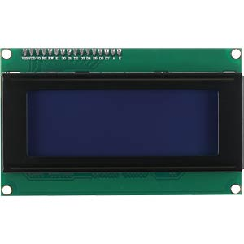
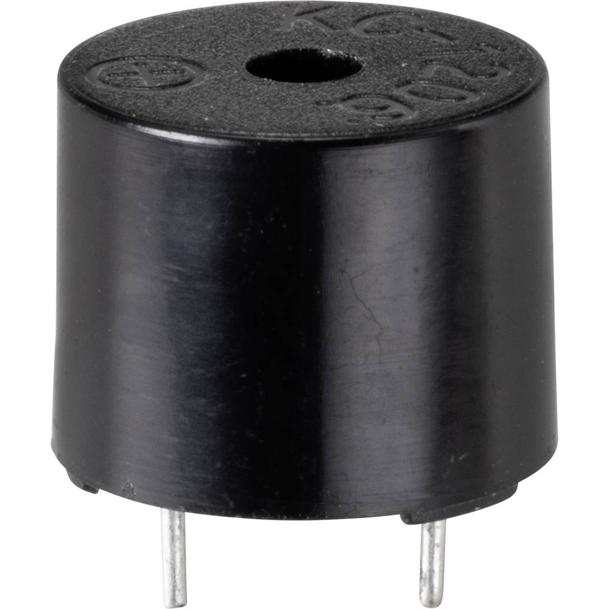
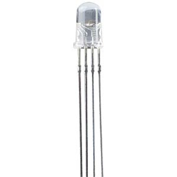
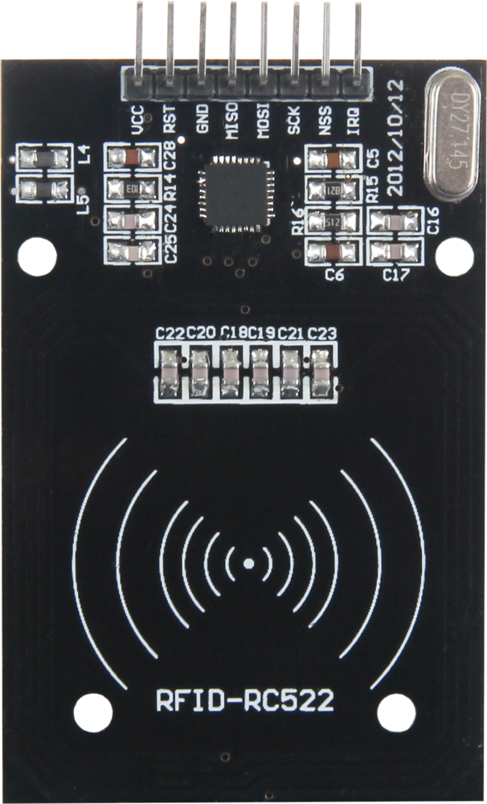
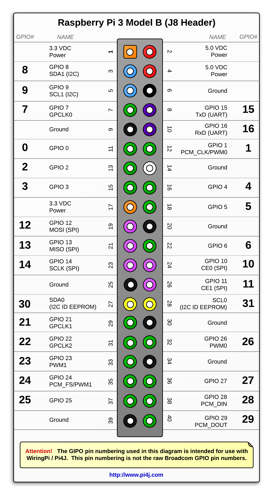

# QuickRegistration
A little embedded system that simplifies the registration of the present students in a lecture.

**Note**: This project was delevoped in italian

## About
In a lot of schools nowadays before the start of every lesson the teacher checks which students are present and which aren't.  
This operation is usually done through a sheet of paper and by hand. It is very repetitive and time consuming.  
Therefore I developed this little device that solves this problem through some simple sensors and a RFID card that every student owns.

## Components

#### Raspberry Pi 3 B+
The brain of this project is a Raspberry Pi 3 B+, every sensor and device will connect to it.

<small>**Image source**: [link](https://www.brack.ch/raspberry-pi-entwicklerboard-raspberry-pi-3-model-b-plus-739538)</small>

#### LCD Display

<small>**Image source**: [link](https://www.reichelt.com/de/en/developer-boards-display-20-x-4-characters-blue-debo-lcd-20x4-bl-p192144.html)</small>

#### Buzzer

<small>**Image source**: [link](https://www.conrad.ch/de/p/tru-components-tc-9202060-piezo-signalgeber-geraeusch-entwicklung-85-db-spannung-5-v-dauerton-1-st-2300515.html)</small>

#### RGB Led

<small>**Image source**: [link](https://www.reichelt.com/ch/de/rgb-led-5-mm-bedrahtet-4-pin-rt-gn-bl-8000-mcd-25--led-ll-5-8000rgb-p156358.html)</small>

#### RFID Reader

<small>**Image source**: [link](https://joy-it.net/en/products/SBC-RFID-RC522)</small>

## Raspberry pin configuration
In order to have a system that works with the given source file every pin has to strictly match the following table.

<small>**Image source**: [link](https://pi4j.com/1.2/pins/model-b-plus.html)</small>

| Component   | Component Pin | RaspberryPi pin (Board Layout) |
| ----------- | ------------- | ------------------------------ |
| LCD         | VCC (5V)      | 02              |
|             | SDA           | 03              |
|             | SCL           | 05              |
|             | GND           | 25              |
| Buzzer      | Signal (+)    | 37              |
|             | GND           | 39              |
| RFID Reader | GND           | 09              |
|             | VCC (3.3V)    | 17              |
|             | MOSI          | 19              |
|             | MISO          | 21              |
|             | RST           | 22              |
|             | SCK           | 23              |
|             | NSS           | 24              |
| RGB Led     | GND           | 06              |
|             | Green         | 07              |
|             | Red           | 11              |
|             | Blue          | 13              |

## Project structure

...

## How to setup

...