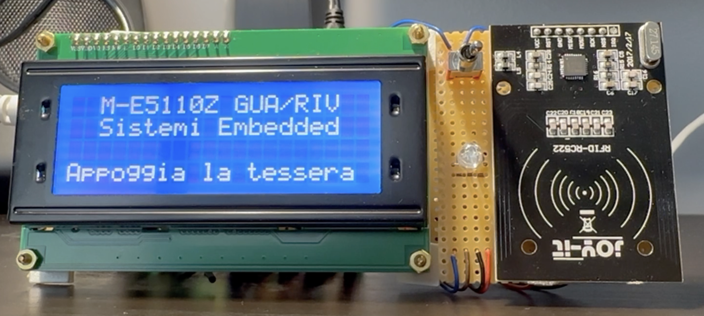

# QuickRegistration
A little embedded system that simplifies the registration of the present students in a lecture.

**Note**: This project was delevoped in italian

## About
In a lot of schools nowadays before the start of every lesson the teacher checks which students are present and which aren't.  
This operation is usually done through a sheet of paper and by hand. It is very repetitive and time consuming.  
Therefore I developed this little device that solves this problem through some simple sensors and a RFID card that every student owns.

